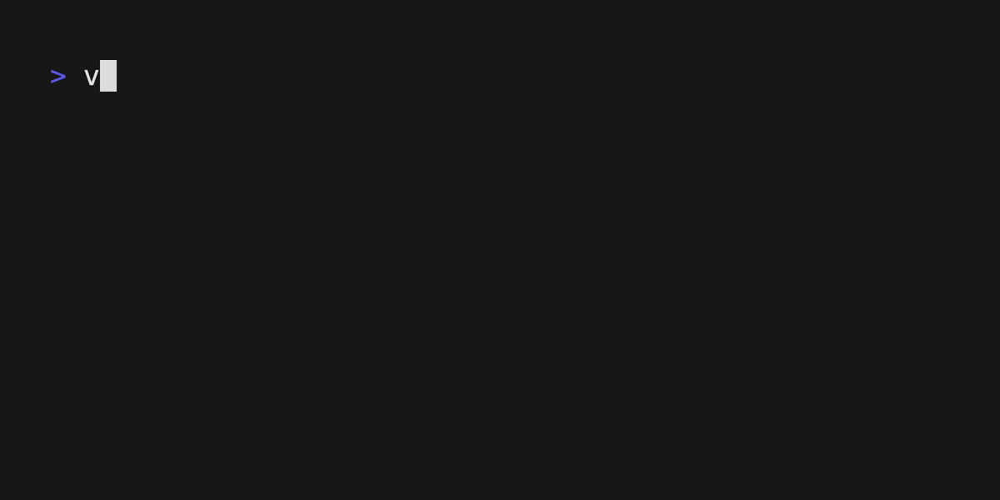

# v-spinner

🌀 A library for V to display customizable spinners on the command line.


## Installation

Add v-spinner to the `dependencies` in your `v.mod`.

```v
// v.mod
Module {
	// ...
	dependencies: [
		// Install from VPM
		'koki-develop.spinner'
		// To install from GitHub
		// 'https://github.com/koki-develop/v-spinner.git'
	]
}
```

By running v install in this state, v-spinner will be installed.

```console
$ v install
```

## Usage

The following program is an example of the simplest usage.

```v
module main

import time

import koki_develop.spinner // When installed from VPM
// import spinner // When installed from GitHub

fn main() {
	mut spin := spinner.new(spinner.character_sets[0])

	spin.start() // Display the spinner
	time.sleep(3 * time.second)
	spin.stop()
}
```


### Setting Prefixes and Suffixes

You can customize prefixes and suffixes by setting the `prefix` and `suffix` attributes.

```v
module main

import time
import koki_develop.spinner // When installed from VPM
// import spinner // When installed from GitHub

fn main() {
	mut spin := spinner.new(spinner.character_sets[0],
		prefix: '[PREFIX] ', // optional
		suffix: ' starting up...' // optional
	)

	spin.start() // Display the spinner
	time.sleep(2 * time.second)

	// It's also possible to change in the middle
	spin.suffix = ' shutting down...'

	time.sleep(2 * time.second)
	spin.stop()
}
```



### Setting the Speed

You can set the interval at which the spinner characters change using the `duration`.

```v
module main

import time
import spinner

fn main() {
	mut spin := spinner.new(spinner.character_sets[0],
		duration: 500 * time.millisecond // Default is 100ms
	)

	spin.start() // Display the spinner
	time.sleep(2 * time.second)

	// It's also possible to change in the middle
	spin.duration = 50 * time.millisecond

	time.sleep(2 * time.second)
	spin.stop()
}
```


### Customizing the Character Set

Several character sets are provided by v-spinner. For details, please refer to "[Character Sets Provided by v-spinner](#character-sets-provided-by-v-spinner)".

By passing an array of arbitrary strings to the first argument of spinner.new, you can use a custom character set.

```v
mut spin := spinner.new(['.', '..', '...'])
```


## Character Sets Provided by v-spinner

Several character sets are provided by v-spinner, and you can use them like `spinner.character_sets[Index]`.

Please refer to the following table for a list of character sets provided by v-spinner.

| Index | Character Set |
| ----- | ------------- |
| `0`   | `\|/-\`       |

## LICENSE

[MIT](./LICENSE)
